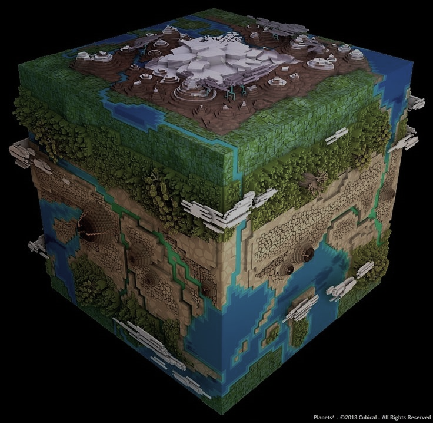

# Zappy

AI trying to survive and evolve in a survival hostile world

| Client (AI)   | Server        | Graphic      |
|:-------------:|:-------------:|:------------:|
| C++           | C             | C# with Unity|

 

## The idea
There is a world, managed by the Server, there are some peoples to live in this world, they are AI, and there you are, as a spectator to look at the evolution of some Robots in a realistic (well they need to eat at least) world.

## The world

 

## The peoples

 

 

 

## The view

 

 

